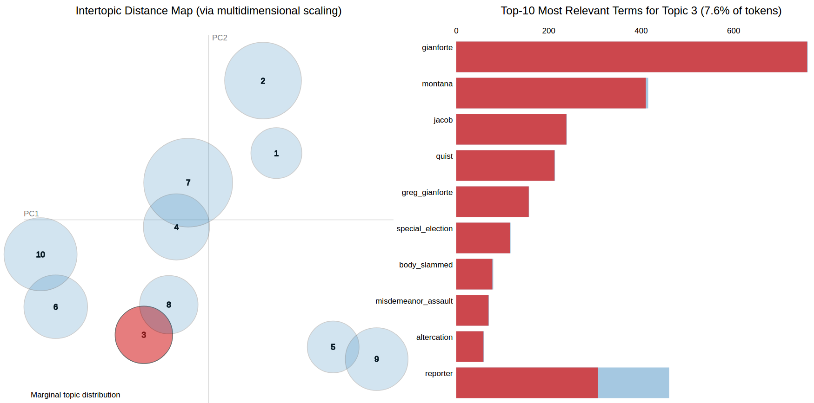
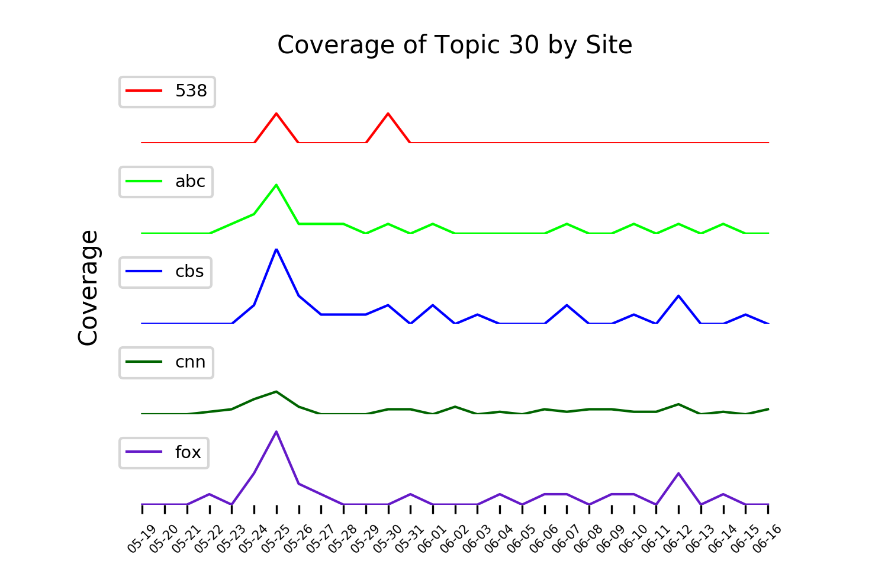
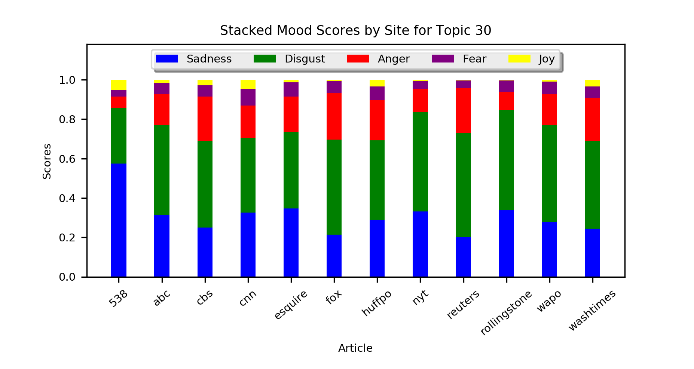

# Analyzing On-line News Journalism
## Motivations
The aim of this project was to provide users with tools to examine political news and the outlets that write it.
In a political climate growing ever more divided I think it is important for people to have the tools to compare news articles and organizations. I have developed tools that allow a user to compare news sites by their mood, sentiment, and objectivity toward certain topics.
A user can pick an analytical piece, opinionated piece, neither or both on a certain topic to read.
This allows one to be informed about the political topics in the news, how they are covered and in what way by different outlets.
The hope is that a user can view all sides of an issue and come to a conclusion on their own about how they feel towards it.

 I extract the topics of a weeks worth of news articles and determine their bias score using the formula: `(postive_sentiment + negative_sentiment)*(1-objective_score)`, where the positive, negative and objective values are determined by the sentiment library and the word probability is the probability that word pertains to that topic and is determined by LDA.

## Data
### Scraping
My data consists of articles gather from the Rich Site Summaries (RSS) feeds of 12 different sites. Those sites with their associated RSS links are [CNN][1], [ABC][2], [FOX][3], [NYT][4], [Reuters][5], [Washing Post][6], [Huffington Post][7], [Esquire][8], [Rolling Stone][9], [CBS][10], [FiveThirtyEight][11], [The Washington Times][12]. Every hour the articles linked from each RSS feed are scraped and saved to a Mongo database on an Amazon Web Services (AWS) server. The data is then converted to a CSV file and stored on an S3 bucket.

All past articles from the Wall Street Journal (WSJ) were available, so they were scraped as well. This may be used in future projects.

### Pre-Processing
The first step in pre-processing was removing stop-words. These are words such as 'the', 'a', 'I', 'him', etc. Next, I created bi-grams, tri-grams and quad-grams. These are new words that are combinations of words that commonly appear next to each other. An example of a quad-gram in extracted from the articles is "fbi_director_james_comey". These help with topic model and for interpretation when viewing the words in a topic. Next, I lemmatized the words. This involves removing inflectional endings of words and returning it to its base word. An example of how this works is changing the word "working" to "work". This too helps with topic modeling and interpretation. Finally, I separated quotes and tweets from an article to get what I called "sentiment texts" to be used with sentiment analysis. The purpose of this was to only use words written by the authors themselves when applying sentiment analysis. Also, as a future project I will examine how different news sites use quotes and tweets. Note that quotes and tweets were still used when modeling the topics.

Also, when performing topic modeling there are words that can appear in all topics that are not stop-words. Since I examined political articles there were several words that appeared often, such as 'Trump', 'president', 'election', 'politics', etc. These words can reduce interpretability of topics, so I decided to remove words that appeared in 50% or more of articles and words that appeared in less than 20. The later was to ensure mis-spelled words or obscure words were not included in topic modeling.

## Methods

### Latent Dirichlet Allocation
Latent Dirichlet Allocation (LDA) is a probabilistic method used to discover latent topics within a series of documents and cluster them accordingly. LDA was used in this project to determine topics in political news sources. Each news article can be considered a mix of multiple topics and LDA assigns a set of topics to each with a probability of it pertaining to that topic. Each topic has a set of words with probabilities of being related to it. Articles with a high frequency of words that have high probabilities of being in a topic will themselves have a high probability of being in that topic. The assumption is that the articles cover a small set of topics and the topics use a small set of words frequently.

LDA requires you to input how many topics you want it to create before running the model. Since I am using all the articles I can get from my news source and the number of topics discussed can be any number, I had to determine how many topics to enter.
There were several attempts to approach this decision in a scientific way, but ultimately I just made several models with varying topics and picked the one that had the most distinguishable topics.
I believe this is an acceptable solution because the attempts I made to scientifically find a number of topics showed that there was a wide range of acceptable values.
The first attempt was to use Hierarchical Dirichlet Process (HDP) LDA, which is an extension of LDA designed to address the issue of not knowing the number of topics before hand.
The goal of HDP is to learn how many topics you need from the data. I used HDP to calculate 150 topics and determined the probability that each of those topics had in regards to the articles.
Unfortunatley I did not see an obvious decision in the number of topics to pick from this.
All topics had less than a 10% probability and decreased at a slow rate to around 5%.
The hope was to see a steep drop in probability and then an 'elbow', where the probability leveled off and we could determine the number of topics to be there.
The second attempt to resolve this issue was using a "coherence" metric.
The idea behind this is that some topics are more coherent than other or in other words people can interpret what one topic is over others.
To determine a topics coherence, I model was created using data collected from people who were told to rate a topic's coherence.
That and a web of word similarities is used. More about that can be learned by reading their [paper][a] on it.
I used this metric on LDA models created using topic number from 5 to 80 and the coherence value did not vary much between any of the models.

### Sentiment
####  SentiWordNet
SentiWordNet is a lexical database that groups English words into sets of synonyms and provides sentiment scores to them. These scores are positive sentiment, negative sentiment and objectivity and are valued from 0 to 1. More about how SentiWordNet can be found by reading their [paper][b]. For all sentiment words found in my sentiment texts discussed in the pre-proccessing section, I found the sentiment scores of all synonyms for that word and took the mean. I then summed these word's scores together for each article to get positive, negative and objective scores for each article. I determined a "sentiment score" I could use to relate these articles and that formula is below.

&nbsp;&nbsp;&nbsp;&nbsp;&nbsp;&nbsp;&nbsp;&nbsp;&nbsp;&nbsp;&nbsp;&nbsp;&nbsp;`sentiment_score = (postive_sentiment + negative_sentiment)*(1-objective_score)`

I came to the conclusion to add positive and negative sentiment because a word can have both a positive and negative score and I noticed an article's positive and negative scores ended up being linearly related. This means that the more positive an article is, generally, the more negative it also is. My belief is that as an author puts more sentiment or emotion into an article, the positive and negative scores tend to go up. Thus, the sentiment score should reflect that instead of the two canceling each other out by subtracting. Next, I considered the subjectivity to be one minus the objectivity and if the author is objective, their sentiment score should be low. Thus, I multiplied by the subject score.

####  ToneAnalyzerV3

IBM' Watson has a Tone Analyzer service that uses linguistic analysis to detect emotional, social and language tones in written text. The analyzer is based on th theory of psycholinguistics, a field of research the explores the relationship between linguistic behavior and psychological theories. The service uses linguistic analysis and the correlation between the linguistic features of written text and emotional, social, and language tones to develop scores for each of these tone dimensions. The emotional tones are Sadness, Joy, Fear, Disgust and Sadness. These are the basic emotions psychologist Paul Ekman classified in his [book][c] and were later personified in as the characters above in the Disney PIXAR movie "Inside Out". IBM's emotional tones were derived from an IBM classification framework. More about this and anything to do with ToneAnalyzerV3 can be found at their [web-page][d].

The emotional tones were used in this project to determine the mood of a topic. Each article was run through the Tone Analyzer and for each topic were summed together to get mood scores for each site. Below is a stacked bar chart of all mood scores by each site for topic 30.

## Topic 30
### Summary
Topic 30 is about Greg Gianforte, who won the U.S. House special election on May 25th, 2017. The day before that he was accused of “body-slamming” a reporter and on June 12, 2017, he pleaded guilty to the assault charge.

### Topic Visualization
Below is a visualization of the topics generated using LDA for 10 topics discussed the week from May 21st, 2017 to May 28th, 2017. This was done to illustrate topic 30 from the 55 topics that were created in the main LDA model I used in this project. In this picture it appears as topic 3 and you can see the top 10 words associated with it on the right hand side.

### Topic Coverage
Below we see the coverage by date of the sites that covered this topic the most. We can clearly see a rise in coverage beginning near the 24th (the day of the assault) and peaking on the 25th. We can also see another spike on June 12th (the day of his trial).

### Topic Mood
To learn more about how mood was calculated, go to the [ToneAnalyzerV3](#tone) section.

## Future Considerations
* How to determine how many features and topics to use in LDA
* Determine whether the article is political
* Use LDA in Spark to find topics of larger WSJ dataset
  * Get topics week to week over 2016 and maybe even further
* Post bias calculations to reddit
* Post bias calculations to twitter
* Web site that displays results and description of models
* Have web page that takes in data from user.
  * Ex: display a topic to user and user inputs name of topic and whether it is liberal of conservative and to what degree.
  * Ex: let user input url with their opinion of what the bias is.
  * Ex: Display article to user and ask them what they think the bias is.

[1]: http://rss.cnn.com/rss/cnn_allpolitics.rss
[2]: http://feeds.abcnews.com/abcnews/politicsheadlines
[3]: http://feeds.foxnews.com/foxnews/politics'
[4]: http://rss.nytimes.com/services/xml/rss/nyt/Politics.xml
[5]: http://feeds.reuters.com/Reuters/PoliticsNews'
[6]: http://feeds.washingtonpost.com/rss/politics
[7]: http://www.huffingtonpost.com/feeds/verticals/politics/index.xml
[8]: http://www.esquire.com/rss/news-politics.xml
[9]: http://www.rollingstone.com/politics/rss
[10]: http://www.cbsnews.com/latest/rss/politics
[11]: https://fivethirtyeight.com/politics/feed/
[12]: http://www.washingtontimes.com/rss/headlines/news/politics/

[a]: http://svn.aksw.org/papers/2015/WSDM_Topic_Evaluation/public.pdf
[b]: http://nmis.isti.cnr.it/sebastiani/Publications/LREC10.pdf
[c]: https://www.paulekman.com/wp-content/uploads/2013/07/Basic-Emotions.pdf
[d]: https://www.ibm.com/watson/developercloud/doc/tone-analyzer/index.html
